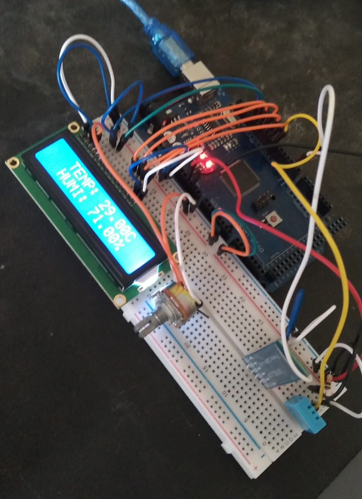

# Poorman's Weather Station 

</img>

Arduino weather station that reads temperature and humidity from an DHT11 sensor,
prints it to an LCD display and sends it through bluetooth to a nearby device. Done in about two days.

There's also an implementation for a server at `src/server/server.py` that reads the data it receives
and inserts it into a database. It logs all measurements as well as hourly
averages.

A Dash panel at `src/dashboard/main.py` plots both variables' time series.

